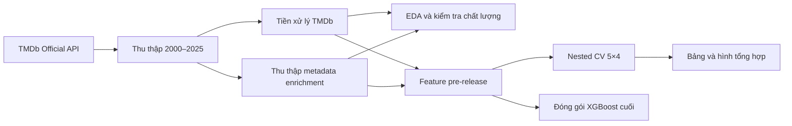

# Dự đoán thành công tài chính của phim trước phát hành

Project môn **Phân tích Dữ liệu** tại **Trường Đại học Mở Thành phố Hồ Chí Minh**.

**Sinh viên thực hiện**

- Phan Tấn Phúc — 2351060029
- Phạm Nguyễn Bảo Vi — 2351060041

## Tổng quan

Project đánh giá mức độ mà thông tin có sẵn trước khi phát hành có thể dự đoán
khả năng thành công tài chính của phim. Bài toán được xây dựng dưới dạng phân
loại nhị phân bằng XGBoost:

```text
is_successful = 1 nếu revenue >= 2 × budget
is_successful = 0 nếu revenue < 2 × budget
```

`budget` là thông tin đầu vào; `revenue` chỉ được dùng để tạo nhãn. Mô hình
không sử dụng popularity, rating, vote, profit, ROI hoặc biến dẫn xuất từ doanh
thu làm predictor.

### Câu hỏi nghiên cứu

Trong phạm vi dữ liệu TMDb giai đoạn 2000–2025, các thông tin có thể biết trước
khi phát hành cho phép dự đoán khả năng một bộ phim đạt doanh thu tối thiểu gấp
hai lần ngân sách ở mức độ nào, và những nhóm đặc trưng nào cung cấp tín hiệu
dự báo đáng kể nhất?

## Kết quả chính

Benchmark chính thức là **XGBoost pre-release operational kết hợp lịch sử
franchise theo thời điểm**, được đánh giá bằng nested Stratified
Cross-Validation 5 outer × 4 inner fold trên 1.646 phim.

| Chỉ số outer-OOF | Giá trị |
| --- | ---: |
| Macro-F1 | **0,719483** |
| F1 lớp không thành công | 0,605128 |
| Recall lớp không thành công | 0,618449 |
| Balanced accuracy | 0,722398 |

Model đóng gói nằm trong [`models/`](models/README.md). Đây là benchmark ngoài
mẫu; không phải điểm huấn luyện của model fit trên toàn bộ dữ liệu.

## Dữ liệu

Nguồn chính thức duy nhất là **TMDb Official API**. Snapshot nghiên cứu gồm
2.597 phim phát hành từ 2000 đến 2025, tối đa 100 phim phổ biến mỗi năm. Tập
modeling giữ 1.646 phim có budget, revenue, runtime và release date hợp lệ.

Dữ liệu không được commit vào repository public. Người dùng cần tự thu thập
bằng TMDb API Read Access Token. Xem chính sách và schema đầu ra tại
[`data/README.md`](data/README.md) và [`docs/data_sources.md`](docs/data_sources.md).

> This product uses the TMDB API but is not endorsed or certified by TMDB.

## Project Structure

```text
movie-success-analysis/
├── .github/workflows/        # Kiểm tra tự động khi push/PR
├── data/                     # Cấu trúc dữ liệu local; dữ liệu thật bị Git bỏ qua
├── docs/                     # Phương pháp, quyết định và kết quả nghiên cứu
├── models/                   # Gói XGBoost chính thức và manifest checksum
├── notebooks/                # Notebook EDA tái lập được
├── reports/
│   ├── figures/              # Hình tổng hợp dùng trong báo cáo
│   └── tables/               # Bảng metric tổng hợp, không chứa dữ liệu từng phim
├── src/                      # Mã nguồn từng bước của pipeline
├── tests/                    # Kiểm tra contract không cần dữ liệu local
├── .env.example              # Mẫu tên biến môi trường, không chứa token thật
├── requirements.txt          # Phiên bản thư viện đã khóa
└── run_pipeline.py           # Điểm vào chung cho toàn bộ workflow
```

## Pipeline Workflow



Mọi imputer, encoder, vocabulary, đặc trưng lịch sử, số vòng boosting và ngưỡng
phân loại đều được học/chọn bên trong training hoặc inner CV. Outer folds chỉ
được dùng để đánh giá cuối cùng.

## How to Run

### 1. Chuẩn bị môi trường

Yêu cầu Python **3.14** và Git.

```powershell
git clone https://github.com/AlizCuli/movie-success-analysis.git
cd movie-success-analysis
py -3.14 -m venv .venv
& '.\.venv\Scripts\python.exe' -m pip install -r requirements.txt
Copy-Item .env.example .env
```

Trên macOS/Linux, thay lệnh tạo và gọi môi trường bằng:

```bash
python3.14 -m venv .venv
./.venv/bin/python -m pip install -r requirements.txt
cp .env.example .env
```

Điền API Read Access Token của bạn vào `.env`:

```text
TMDB_API_TOKEN=your_read_access_token_here
```

Không commit `.env` hoặc hiển thị token trong log.

### 2. Chạy pipeline

Chạy toàn bộ quy trình:

```powershell
& '.\.venv\Scripts\python.exe' run_pipeline.py all
```

Hoặc chạy từng chặng độc lập:

```powershell
& '.\.venv\Scripts\python.exe' run_pipeline.py collect
& '.\.venv\Scripts\python.exe' run_pipeline.py preprocess
& '.\.venv\Scripts\python.exe' run_pipeline.py enrich
& '.\.venv\Scripts\python.exe' run_pipeline.py eda
& '.\.venv\Scripts\python.exe' run_pipeline.py evaluate
& '.\.venv\Scripts\python.exe' run_pipeline.py train
& '.\.venv\Scripts\python.exe' run_pipeline.py report
```

`collect` có checkpoint và không tải lại dữ liệu hoàn chỉnh nếu không cần.
`evaluate` chạy nested CV nên là chặng tốn thời gian nhất. Dữ liệu và dự đoán
cấp từng phim được giữ local theo `.gitignore`.

TMDb là nguồn sống nên snapshot mới có thể khác 2.597/1.646 dòng. Pipeline xử lý
theo số dòng thực tế; benchmark 0,719483 chỉ tái lập chính xác với snapshot và
phiên bản dependency ghi trong manifest của model đã công bố.

### 3. Kiểm tra repository

```powershell
& '.\.venv\Scripts\python.exe' -m compileall -q src tests run_pipeline.py
& '.\.venv\Scripts\python.exe' -m unittest discover -s tests -v
```

### 4. Dự đoán bằng model đóng gói

Xem schema đầu vào:

```powershell
& '.\.venv\Scripts\python.exe' src\predict_xgboost.py --show-schema
```

Thực hiện dự đoán trên CSV metadata đã được cấu trúc hóa:

```powershell
& '.\.venv\Scripts\python.exe' src\predict_xgboost.py input.csv output.csv
```

Chi tiết về các trường bắt buộc và giới hạn suy luận được trình bày trong
[`docs/model_input_schema.md`](docs/model_input_schema.md).

## Tài liệu và artifact chính

- [`notebooks/01_eda.ipynb`](notebooks/01_eda.ipynb): EDA TMDb-only.
- [`docs/report_outline.md`](docs/report_outline.md): bố cục báo cáo học thuật.
- [`docs/xgboost_results.md`](docs/xgboost_results.md): kết quả benchmark.
- [`docs/tuning_registry.md`](docs/tuning_registry.md): lịch sử thí nghiệm để
  tránh lặp lại hướng đã bị loại.
- [`GPT_CONTEXT.md`](GPT_CONTEXT.md): hồ sơ bàn giao cho GPT/Codex.

## Giới hạn

- Mẫu tối đa 100 phim phổ biến mỗi năm, không phải mẫu ngẫu nhiên của toàn thị
  trường.
- Budget và revenue TMDb còn thiếu đáng kể; chỉ phim có target hợp lệ mới vào
  tập modeling.
- Metadata TMDb là snapshot hiện tại. Vì vậy phạm vi được gọi là
  *pre-release operational*, không phải archive lịch sử tuyệt đối của mọi trường.
- `revenue >= 2 × budget` là quy ước thành công tài chính của project.
