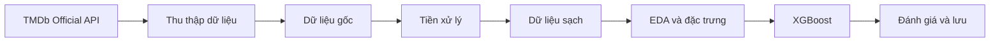

# Dự đoán khả năng thành công tài chính của phim dựa trên thông tin có sẵn trước khi phát hành

Dự án học phần **Phân tích Dữ liệu**, **Trường Đại học Mở Thành phố Hồ Chí Minh**.

**Sinh viên thực hiện**

- Phan Tấn Phúc — 2351060029
- Phạm Nguyễn Bảo Vi — 2351060041

## Tổng quan

Nghiên cứu đánh giá mức độ mà thông tin có sẵn trước khi phát hành cho phép dự
đoán khả năng thành công tài chính của phim. Bài toán được biểu diễn dưới dạng
phân loại nhị phân và giải quyết bằng XGBoost:

```text
is_successful = 1 nếu revenue >= 2 × budget
is_successful = 0 nếu revenue < 2 × budget
```

`budget` là đặc trưng đầu vào; `revenue` chỉ được sử dụng để xác lập nhãn. Mô
hình không sử dụng `popularity`, điểm đánh giá, lượt bình chọn, `profit`, ROI
hoặc bất kỳ biến dẫn xuất nào từ doanh thu làm đặc trưng dự báo.

### Câu hỏi nghiên cứu

Trong phạm vi dữ liệu TMDb giai đoạn 2000–2025, các thông tin có thể biết trước
khi phát hành cho phép dự đoán khả năng một bộ phim đạt doanh thu tối thiểu gấp
hai lần ngân sách ở mức độ nào, và những nhóm đặc trưng nào cung cấp tín hiệu
dự báo đáng kể nhất?

## Kết quả chính

Cấu hình tham chiếu chính thức là **XGBoost sử dụng thông tin trước phát hành
theo phạm vi vận hành, kết hợp lịch sử franchise theo thời điểm**. Mô hình được
đánh giá bằng kiểm định chéo phân tầng lồng nhau gồm 5 vòng ngoài và 4 vòng
trong trên 1.646 phim.

| Chỉ số trên dự đoán ngoài mẫu gộp | Giá trị |
| --- | ---: |
| Macro-F1 | **0,719483** |
| F1 lớp không thành công | 0,605128 |
| Recall lớp không thành công | 0,618449 |
| Balanced accuracy | 0,722398 |

Gói mô hình nằm trong [`models/`](models/README.md). Các chỉ số trên là kết quả
ngoài mẫu, không phải kết quả huấn luyện của mô hình được khớp trên toàn bộ dữ
liệu.

## Dữ liệu

Nguồn dữ liệu chính thức duy nhất là **TMDb Official API**. Ảnh chụp dữ liệu
nghiên cứu gồm 2.597 phim phát hành trong giai đoạn 2000–2025, với tối đa 100
phim phổ biến mỗi năm. Tập dữ liệu mô hình hóa gồm 1.646 phim có `budget`,
`revenue`, `runtime` và `release_date` hợp lệ.

Dữ liệu cấp phim không được phân phối trong repository công khai. Việc tái tạo
dữ liệu yêu cầu TMDb API Read Access Token. Chính sách phân phối và lược đồ đầu
ra được trình bày tại
[`data/README.md`](data/README.md) và [`docs/data_sources.md`](docs/data_sources.md).

> This product uses the TMDB API but is not endorsed or certified by TMDB.

## Project Structure

```text
movie-success-analysis/
├── .github/workflows/        # Kiểm tra tự động khi cập nhật mã nguồn
├── data/                     # Cấu trúc dữ liệu cục bộ; dữ liệu thật không được phép công bố
├── docs/                     # Phương pháp, quyết định và kết quả nghiên cứu
├── models/                   # Gói XGBoost chính thức, manifest và checksum
├── notebooks/                # Notebook EDA có thể tái lập
├── reports/
│   ├── figures/              # Hình tổng hợp dùng trong báo cáo
│   └── tables/               # Bảng chỉ số tổng hợp, không chứa dữ liệu từng phim
├── src/                      # Mã nguồn của từng công đoạn xử lý
├── tests/                    # Kiểm tra giao ước không cần dữ liệu cục bộ
├── .env.example              # Mẫu tên biến môi trường, không chứa token thật
├── requirements.txt          # Phiên bản thư viện đã khóa
└── run_pipeline.py           # Điểm thực thi chung cho toàn bộ quy trình
```

## Pipeline Workflow



Bộ điền khuyết, bộ mã hóa, từ vựng, trạng thái đặc trưng lịch sử, số vòng
boosting và ngưỡng phân loại đều được học hoặc lựa chọn trong dữ liệu huấn
luyện của từng vòng kiểm định. Các vòng ngoài chỉ phục vụ đánh giá cuối cùng.

## How to Run

### 1. Chuẩn bị môi trường

Yêu cầu Python **3.14** và Git.

```powershell
git clone https://github.com/AlizCuli/movie-success-analysis.git
cd movie-success-analysis
py -3.14 -m venv .venv
& '.\.venv\Scripts\python.exe' -m pip install -r requirements.txt
Copy-Item .env.example .env
```

Trên macOS/Linux, thay lệnh tạo và gọi môi trường bằng:

```bash
python3.14 -m venv .venv
./.venv/bin/python -m pip install -r requirements.txt
cp .env.example .env
```

Khai báo API Read Access Token trong `.env`:

```text
TMDB_API_TOKEN=your_read_access_token_here
```

File `.env` phải được giữ ngoài Git và token không được ghi vào nhật ký chạy.

### 2. Chạy quy trình

Chạy toàn bộ quy trình:

```powershell
& '.\.venv\Scripts\python.exe' run_pipeline.py all
```

Hoặc chạy từng chặng độc lập:

```powershell
& '.\.venv\Scripts\python.exe' run_pipeline.py collect
& '.\.venv\Scripts\python.exe' run_pipeline.py preprocess
& '.\.venv\Scripts\python.exe' run_pipeline.py enrich
& '.\.venv\Scripts\python.exe' run_pipeline.py eda
& '.\.venv\Scripts\python.exe' run_pipeline.py evaluate
& '.\.venv\Scripts\python.exe' run_pipeline.py train
& '.\.venv\Scripts\python.exe' run_pipeline.py report
```

`collect` sử dụng điểm kiểm tra để hỗ trợ tiếp tục quá trình thu thập và tránh
tải lại file đã hoàn chỉnh. `evaluate` thực hiện kiểm định chéo lồng nhau nên có
chi phí tính toán lớn nhất. Dữ liệu và dự đoán cấp từng phim được lưu cục bộ
theo quy tắc trong `.gitignore`.

TMDb được cập nhật liên tục nên ảnh chụp dữ liệu mới có thể khác quy mô
2.597/1.646 dòng. Quy trình xử lý thích ứng với số dòng thực tế; kết quả
0,719483 chỉ có thể được tái lập chính xác với cùng ảnh chụp dữ liệu và các
phiên bản thư viện được ghi trong manifest của mô hình.

### 3. Kiểm tra kho mã nguồn

```powershell
& '.\.venv\Scripts\python.exe' -m compileall -q src tests run_pipeline.py
& '.\.venv\Scripts\python.exe' -m unittest discover -s tests -v
```

### 4. Suy luận bằng mô hình đóng gói

Xem lược đồ đầu vào:

```powershell
& '.\.venv\Scripts\python.exe' src\predict_xgboost.py --show-schema
```

Thực hiện dự đoán trên CSV siêu dữ liệu đã được cấu trúc hóa:

```powershell
& '.\.venv\Scripts\python.exe' src\predict_xgboost.py input.csv output.csv
```

Chi tiết về các trường bắt buộc và giới hạn suy luận được trình bày trong
[`docs/model_input_schema.md`](docs/model_input_schema.md).

## Tài liệu và kết quả chính

- [`notebooks/01_eda.ipynb`](notebooks/01_eda.ipynb): EDA TMDb-only.
- [`docs/report_outline.md`](docs/report_outline.md): bố cục báo cáo học thuật.
- [`docs/xgboost_results.md`](docs/xgboost_results.md): kết quả tham chiếu.
- [`docs/tuning_registry.md`](docs/tuning_registry.md): lịch sử thí nghiệm để
  tránh lặp lại hướng đã bị loại.

## Giới hạn

- Mẫu tối đa 100 phim phổ biến mỗi năm, không phải mẫu ngẫu nhiên của toàn thị
  trường.
- `budget` và `revenue` trên TMDb còn thiếu đáng kể; chỉ phim có biến mục tiêu
  hợp lệ mới được đưa vào tập dữ liệu mô hình hóa.
- Siêu dữ liệu TMDb là ảnh chụp ở thời điểm thu thập, không phải kho lưu trữ
  lịch sử chứng minh thời điểm công bố của mọi trường. Vì vậy, nghiên cứu sử
  dụng phạm vi trước phát hành theo quy ước vận hành.
- `revenue >= 2 × budget` là tiêu chuẩn thành công tài chính được xác lập trong
  phạm vi nghiên cứu.
