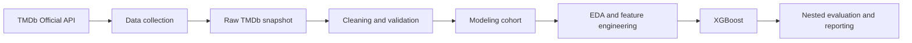

# Movie Success Analysis

> Can information available before release identify films that meet a project-defined financial-success threshold?

[](https://github.com/AlizCules/Movie-Success-Analysis/actions/workflows/ci.yml)
[](https://www.python.org/)

An individual Data Analysis project at Ho Chi Minh City Open University. The
study uses the TMDb Official API to acquire movie metadata, validate coverage,
describe pre-release patterns, engineer features, and evaluate an XGBoost
classifier without using post-release predictors.

| 2,597 collected movies | 1,646 modeling observations | 2000–2025 snapshot | Macro-F1 0.719483 |
| --- | --- | --- | --- |
| TMDb Official API | Python and pandas | EDA and feature engineering | Leakage-safe evaluation |

## Analytical question

Within the TMDb 2000–2025 research snapshot, how informative are movie
characteristics available within the defined pre-release operational scope for
classifying whether:

```text
is_successful = 1 if revenue >= 2 * budget
is_successful = 0 otherwise
```

The threshold is an operational criterion defined for this study. `revenue`
constructs the label and is never used as a model input.

## Workflow



The workflow comprises data acquisition, validation, exploratory analysis,
feature engineering, predictive evaluation, and reporting. Row-level TMDb
files remain local; the repository tracks source code, aggregate tables,
figures, model artifacts, and validation checks.

## Data and scope

The collection contains up to 100 popular, non-adult, non-video films per year
from 2000 through 2025. The modeling cohort contains 1,646 films with valid
budget, revenue, runtime, release date, and target values. The two classes are
477 unsuccessful films and 1,169 successful films.

The only source used for the final analysis is the TMDb Official API. Popularity,
ratings, vote counts, profit, ROI, and revenue-derived variables are excluded
from the predictors. See [data sources and collection scope](docs/data_sources.md)
for endpoint and distribution details.

## Exploratory analysis

The figures describe the sampled snapshot and do not establish causal effects.

### Data quality and modeling cohort


Budget and revenue are missing in 32.9% and 32.3% of collected records. These
fields determine whether the financial-success label can be constructed.

### Genre and collection patterns


Collection films exhibit higher observed success rates than non-collection films
in the sampled genre groups. For example, Action is 81.7% for collection films
versus 48.5% for non-collection films. The underlying counts and rates are
available in [`success_by_primary_genre_collection.csv`](reports/tables/success_by_primary_genre_collection.csv).

### Theatrical release breadth


Observed success rates range from 28.6% in the 0–5-market group to 77.7% in the
more-than-30-market group. This descriptive difference is supported by
[`success_by_theatrical_release_breadth.csv`](reports/tables/success_by_theatrical_release_breadth.csv)
and should not be interpreted as evidence that market count alone causes
financial success.

The correlation table reports the largest basic associations with the label as
`is_collection` (ρ = 0.283), `theatrical_country_count` (ρ = 0.245), and
`release_event_count` (ρ = 0.192). The full table is
[`pre_release_spearman.csv`](reports/tables/pre_release_spearman.csv).

## Predictive evaluation

The reference configuration is XGBoost with metadata, TMDb enrichment, and
time-aware franchise-history features within the defined pre-release scope.
Evaluation uses 5 outer and 4 inner stratified folds. All imputation, encoding,
feature construction, tuning, and threshold selection are restricted to the
corresponding training or inner-validation data.


| Out-of-sample metric | Score |
| --- | ---: |
| Macro-F1 | **0.719483** |
| F1, unsuccessful class | 0.605128 |
| Balanced accuracy | 0.722398 |
| Accuracy | 0.766100 |

The complete benchmark and interpretation are documented in [XGBoost results](docs/xgboost_results.md). The experiment registry records rejected feature directions and tuning decisions in [`docs/tuning_registry.md`](docs/tuning_registry.md).

## Leakage controls

- `revenue` creates the target and is excluded from predictors.
- Popularity, ratings, vote counts, profit, ROI, and revenue-derived variables
  are excluded.
- Imputation, encoding, and feature engineering are fit within training folds.
- Hyperparameter and threshold selection occur inside the inner folds; outer
  folds are reserved for final out-of-sample evaluation.
- Franchise-history features use only earlier releases and do not update the
  history state with validation or test rows.

## Repository structure

```text
movie-success-analysis/
|-- data/             # Local data structure; row-level files are excluded
|-- docs/             # Methodology, findings, experiments, and limitations
|-- models/           # Official XGBoost bundle and manifest
|-- notebooks/        # EDA and report-figure reproduction notebook
|-- reports/          # Public aggregate tables and figures
|-- src/              # Collection, preprocessing, analysis, and modeling code
|-- tests/            # Repository contract tests
|-- run_pipeline.py   # Pipeline entry point
`-- requirements.txt  # Pinned dependencies
```

## Quick start

Use Python 3.14 and install the pinned dependencies in an isolated environment.

```bash
git clone https://github.com/AlizCules/Movie-Success-Analysis.git
cd Movie-Success-Analysis
python -m venv .venv
```

```bash
# Windows PowerShell
.venv\Scripts\Activate.ps1

# macOS/Linux
source .venv/bin/activate
```

```bash
pip install -r requirements.txt
# Windows PowerShell: Copy-Item .env.example .env
# macOS/Linux: cp .env.example .env
```

Set a local TMDb Read Access Token in `.env`:

```text
TMDB_API_TOKEN=your_read_access_token_here
```

Run the full workflow with `python run_pipeline.py all`. Individual stages are
available as `collect`, `preprocess`, `enrich`, `eda`, `evaluate`, `train`,
`report`, and `figures`. The `evaluate` stage is the most computationally
expensive. A fresh clone can inspect committed aggregate reports and PNG files;
recreating row-level artifacts requires a local TMDb snapshot.

## Documentation

- [Data sources and collection scope](docs/data_sources.md)
- [EDA findings](docs/eda_findings.md)
- [Model input schema](docs/model_input_schema.md)
- [Pre-release operational scope](docs/pre_release_operational_scope.md)
- [Preprocessing decisions](docs/preprocessing_decisions.md)
- [Official XGBoost results](docs/xgboost_results.md)
- [Experiment registry](docs/tuning_registry.md)
- [Franchise-history findings](docs/operational_franchise_history_findings.md)
- [Report assets and figure reproduction](reports/README.md)
- [Model package details](models/README.md)
- [Development guide](DEVELOPMENT.md)

## Limitations

- The collection samples at most 100 popular movies per year and is not a
  random sample of the full movie market.
- Missing TMDb financial values reduce the modeling cohort from 2,597 collected
  movies to 1,646 observations.
- TMDb metadata is a current snapshot, not a complete historical point-in-time
  archive for every field.
- `revenue >= 2 * budget` is a project-defined classification rule rather than
  an accounting profit measure.
- The unsuccessful class has lower predictive performance than the successful
  class; the model is not a stand-alone high-stakes financial decision tool.
- EDA associations may reflect confounding and sample-selection effects and do
  not establish causality.

## Project context and author

Developed as an individual Data Analysis project at Ho Chi Minh City Open
University.

**Phan Tấn Phúc**
Data Science Student, Ho Chi Minh City Open University
GitHub: [@AlizCules](https://github.com/AlizCules)

## TMDb attribution

This product uses the TMDB API but is not endorsed or certified by TMDB.
