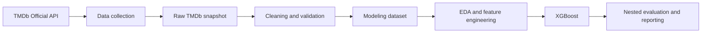
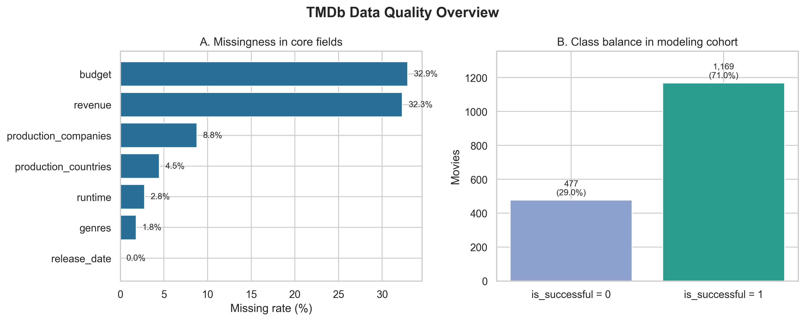
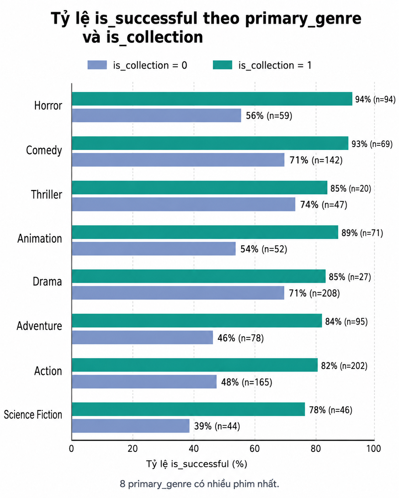
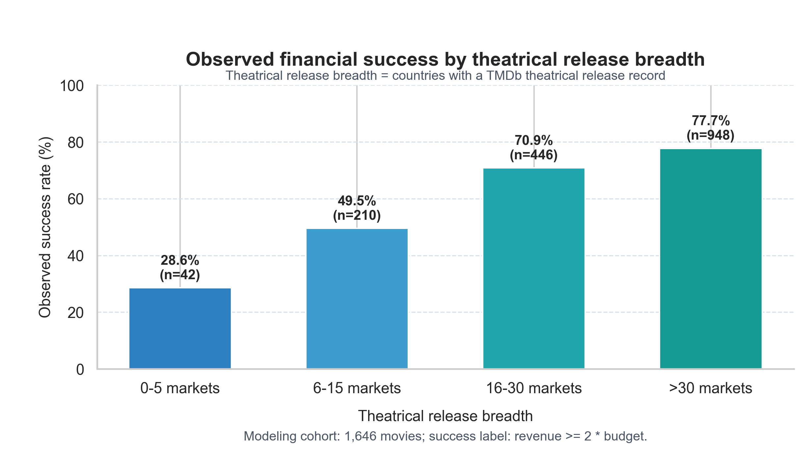
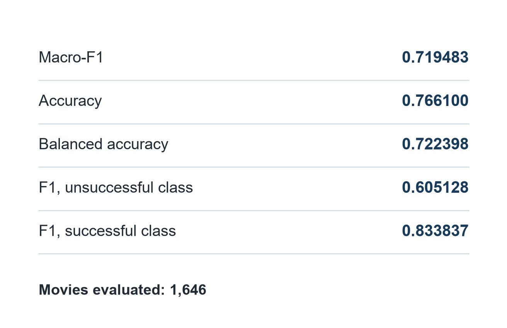

# Movie Success Analysis

> Can information available before a movie's release help identify films that meet a project-defined financial-success threshold?

[](https://www.python.org/)

An end-to-end, individual data analysis project using the TMDb Official API. It combines data collection, validation, exploratory analysis, leakage-safe feature engineering, and nested cross-validation to evaluate pre-release signals of movie financial success.

| 2,597 movies collected | 1,646 modeling observations | 2000-2025 snapshot | 0.719483 Macro-F1 |
| :--- | :--- | :--- | :--- |
| TMDb Official API | Valid financial fields | 100 popular movies/year maximum | Nested outer-OOF evaluation |

## Project Overview

The project asks whether movie metadata available before release can help distinguish films that achieve a return of at least two times their budget. The workflow is intentionally framed as data analysis first: acquire real-world API data, validate the usable population, investigate patterns, engineer pre-release features, and then evaluate their predictive value without leaking post-release outcomes into the model.

## Analytical Question

Within the TMDb 2000-2025 research snapshot, how informative are operationally pre-release movie characteristics for classifying whether:

```text
is_successful = 1 if revenue >= 2 * budget
is_successful = 0 otherwise
```

`revenue` constructs the label only. It is never a model input.

## Project at a Glance

| Item | Verified value |
| --- | --- |
| Data source | TMDb Official API |
| Research period | 2000-2025 |
| Movies collected | 2,597 |
| Modeling sample | 1,646 movies |
| Financial-success criterion | Revenue >= 2 * budget |
| Final model | XGBoost with operationally pre-release features |
| Evaluation protocol | 5 outer x 4 inner nested stratified cross-validation |
| Primary metric | Macro-F1 |
| Official Macro-F1 | 0.719483 |

## Data Pipeline



The repository keeps row-level TMDb data local and version-controls code, aggregate tables, model artifacts, figures, and validation checks instead.

## Exploratory Data Analysis

The EDA focuses on coverage, class balance, and associations among variables that are in the project-defined operational pre-release scope. These charts describe the sampled TMDb snapshot; they do not establish causal effects.

### Data Quality and Modeling Cohort



Budget and revenue are the primary coverage constraint: 32.9% and 32.3% of the collected records, respectively, are missing these fields. Requiring valid budget, revenue, runtime, and release date yields the 1,646-film modeling cohort, in which 29.0% are labelled unsuccessful.

### Genre and Collection Patterns



Across the eight most common primary genres, films tagged as part of a collection have higher observed success rates in this sample. For example, Action is 81.7% for collection films versus 48.5% for non-collection films; Adventure is 84.2% versus 46.2%. The chart reports group sizes because some genre and collection combinations are small.

### Theatrical Release Breadth



Observed success rates rise from 28.6% in the 0-5-market group (n=42) to 77.7% in the more-than-30-market group (n=948). This is an association in the TMDb snapshot, not evidence that increasing market count alone causes success.

## Key Insights

1. **Financial fields determine usable coverage.** Missing budget and revenue exclude roughly one third of the collected movies from target construction, so the final cohort represents films with usable TMDb financial metadata rather than all movies released in the period.
2. **Collection status is a meaningful descriptive signal, but not a causal claim.** Its Spearman association with the success label is 0.283, the largest among the basic pre-release variables summarized in [`pre_release_spearman.csv`](reports/tables/pre_release_spearman.csv). The genre comparison shows why interactions matter instead of relying on a genre-only rule.
3. **Release breadth is strongly associated with the outcome.** The 49.1 percentage-point difference between the smallest and largest theatrical-market groups should be interpreted with context: release breadth may proxy for distribution decisions, scale, or other unobserved factors.
4. **No single basic feature is decisive.** The next-largest associations with the label are theatrical-country count (0.245) and release-event count (0.192). This supports combining multiple pre-release signals in a validated model rather than making decisions from one heuristic.

## Predictive Modeling

The finalized XGBoost configuration combines basic movie metadata, TMDb enrichment, and time-aware franchise-history features within the project's operational pre-release scope. It uses 51 raw pre-release features that expand to 160 transformed features after preprocessing.

The configuration was selected through documented experiments, including rejected feature sets and tuning decisions, in the [experiment registry](docs/tuning_registry.md). The final benchmark uses Macro-F1 because the modeling cohort is imbalanced (477 unsuccessful vs. 1,169 successful movies).

### Results



| Out-of-sample metric | Score |
| --- | ---: |
| Macro-F1 | **0.719483** |
| F1, unsuccessful class | 0.605128 |
| Balanced Accuracy | 0.722398 |
| Accuracy | 0.766100 |

These are pooled predictions from the five outer folds of nested cross-validation, not training performance. The model is stronger on the successful class (F1 = 0.833837) than on the unsuccessful class, so the reported Macro-F1 and class-specific F1 remain more informative than accuracy alone.

## Leakage-Safe Evaluation

The reported result is designed to avoid an inflated estimate of predictive usefulness.

- `revenue` creates the target and is excluded from predictors.
- Post-release fields such as popularity, ratings, vote counts, profit, ROI, and revenue-derived variables are excluded.
- Imputation, encoding, and feature engineering are fit within the relevant training folds.
- Tuning and threshold selection happen in the four inner folds; the five outer folds are reserved for final evaluation.
- Franchise-history features only use movies released earlier than the film being represented.
- The project documents its metadata scope honestly: TMDb is a current snapshot, not a complete point-in-time historical archive.

## Project Structure

```text
movie-success-analysis/
|-- data/             # Local data structure; row-level TMDb files are excluded from Git
|-- docs/             # Methodology, data notes, experiments, and detailed results
|-- models/           # Official XGBoost bundle, manifest, and checksums
|-- notebooks/        # Reproducible EDA notebook
|-- reports/          # Public aggregate tables and figures
|-- src/              # Collection, preprocessing, EDA, modeling, and reporting code
|-- tests/            # Repository contract tests
|-- run_pipeline.py   # Pipeline entry point
`-- requirements.txt  # Pinned dependencies
```

## Quick Start

Use Python 3.14, then create an isolated environment and install the pinned dependencies.

```bash
git clone https://github.com/AlizCuli/movie-success-analysis.git
cd movie-success-analysis

python -m venv .venv
```

Activate the environment:

```bash
# Windows PowerShell
.venv\\Scripts\\Activate.ps1

# macOS/Linux
source .venv/bin/activate
```

Install dependencies and configure a local TMDb API token:

```bash
pip install -r requirements.txt
# Windows PowerShell: Copy-Item .env.example .env
# macOS/Linux: cp .env.example .env
```

Set the token in `.env` without committing the file:

```text
TMDB_API_TOKEN=your_read_access_token_here
```

Run the full workflow:

```bash
python run_pipeline.py all
```

Individual stages are available as `collect`, `preprocess`, `enrich`, `eda`, `evaluate`, `train`, `report`, and `figures`. `evaluate` runs nested cross-validation and is the most computationally expensive stage. A fresh clone can inspect the committed aggregate reports and PNG figures immediately, but regenerating row-level artifacts requires a local TMDb snapshot.

## Documentation

- [Data source and collection scope](docs/data_sources.md)
- [EDA findings](docs/eda_findings.md)
- [Model input schema](docs/model_input_schema.md)
- [Official XGBoost results](docs/xgboost_results.md)
- [Experiment registry](docs/tuning_registry.md)
- [Report assets and figure reproduction](reports/README.md)
- [Model package details](models/README.md)

## Limitations

- The collection strategy samples at most 100 popular movies per year and is not a random sample of the full movie market.
- Missing TMDb financial values reduce the modeling cohort from 2,597 collected movies to 1,646 observations.
- TMDb metadata is a current snapshot, not a complete historical point-in-time archive for every field.
- The financial-success threshold, revenue >= 2 * budget, is a project-defined classification rule.
- The unsuccessful class has lower predictive performance, so the model should not be used as a stand-alone high-stakes financial decision tool.
- Associations in the EDA are descriptive and may reflect confounding or sample-selection effects.

## Project Context

Developed as an individual Data Analysis project at Ho Chi Minh City Open University and refined into an end-to-end data analytics portfolio project.

## Author

**Phan Tấn Phúc**<br>
Data Science Student, Ho Chi Minh City Open University<br>
GitHub: [@AlizCuli](https://github.com/AlizCuli)

## TMDb Attribution

This product uses the TMDB API but is not endorsed or certified by TMDB.
